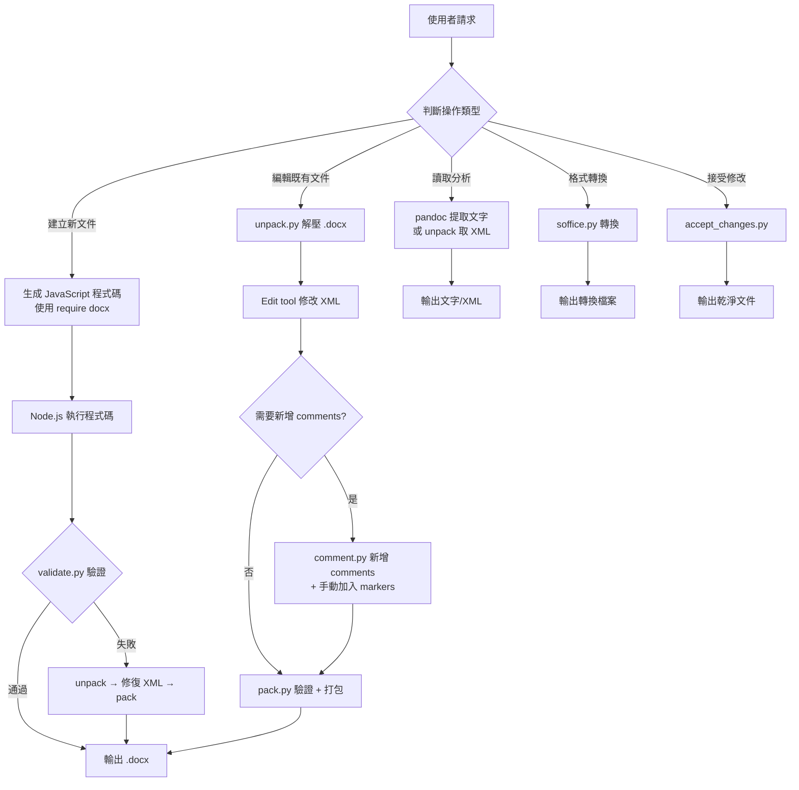

# DOCX 技能包 — 逆向工程邏輯文檔

## 概述

**docx** 技能包用於建立、讀取、編輯和操作 Word 文件（.docx）。它是為 Claude Code（本地 agent）設計的完整 Word 文件處理工具箱，包含：

- **JavaScript (docx-js)**：用於從零建立新文件
- **Python 腳本**：用於解壓/驗證/重新打包既有文件的 XML 結構
- **LibreOffice 整合**：格式轉換和追蹤修改接受

### NexusMind 適配問題（已修正）

此技能包原為本地 agent 設計，直接作為 Gemini system prompt 時存在以下問題：

| 問題 | 根因 | 修正方案 |
|------|------|---------|
| LLM 混淆執行路徑 | SKILL.md 同時描述 JS 和 Python 兩條路徑 | 加入 preamble 明確指定 JS 輸出 |
| LLM 引用不存在的工具 | SKILL.md 提到 "Edit tool"、pandoc 等 | preamble 禁止引用 agent 工具 |
| 程式碼提取失敗無診斷 | JS_ENTRYPOINT_SCRIPT 靜默失敗 | 加入錯誤訊息和非零 exit code |
| 輸出路徑不一致 | SKILL.md 範例寫 "doc.docx" 無完整路徑 | preamble 要求寫入 /output/ |

---

## 觸發條件

1. **必須觸發**：使用者提到 Word、.docx、Word document
2. **應該觸發**：使用者要求報告、備忘錄、信件、範本等專業文件
3. **可能觸發**：使用者要求文件格式轉換或追蹤修改處理

**排除條件**：PDF、試算表、Google Docs、與文件生成無關的程式碼任務

---

## 完整流程圖

---

## 步驟詳解

### 路徑 1：建立新文件（docx-js / JavaScript）

**這是 NexusMind 沙箱環境中的主要路徑。**

1. **寫 JavaScript 程式碼**
   - 使用 `require('docx')` 載入 docx-js 套件
   - 建立 `Document` 物件，設定 sections、properties、children
   - 必須明確設定頁面大小（預設 A4，非 US Letter）
   - 使用 `Packer.toBuffer(doc)` 生成 Buffer
   - 使用 `fs.writeFileSync('/output/filename.docx', buffer)` 寫出

2. **關鍵 API 元素**：
   - `Document`: 文件根物件（sections 陣列）
   - `Paragraph`: 段落（children 含 TextRun）
   - `TextRun`: 文字區塊（bold、italic、font、size 等）
   - `Table / TableRow / TableCell`: 表格
   - `ImageRun`: 圖片（需 type 參數）
   - `Header / Footer`: 頁首頁尾
   - `TableOfContents`: 目錄（需 HeadingLevel 標題）
   - `PageBreak`: 換頁（必須在 Paragraph 內）

3. **頁面大小（DXA 單位，1440 = 1 英吋）**：

| 紙張 | Width | Height | 內容寬度 (1 inch margin) |
|------|-------|--------|---------------------|
| US Letter | 12,240 | 15,840 | 9,360 |
| A4 (預設) | 11,906 | 16,838 | 9,026 |

4. **驗證**：`python scripts/office/validate.py doc.docx`

### 路徑 2：編輯既有文件（Python XML 操作）

**此路徑在 NexusMind 沙箱中不可用（需要輸入檔案和 Edit tool）。**

1. **Unpack**: `python scripts/office/unpack.py document.docx unpacked/`
2. **編輯 XML**: 使用 Edit tool 直接修改 unpacked/word/document.xml
3. **Repack**: `python scripts/office/pack.py unpacked/ output.docx --original document.docx`

---

## 約束和護欄

### CRITICAL

1. 明確設定頁面大小（docx-js 預設 A4）
2. 不用 \n — 用 new Paragraph()
3. 不用 Unicode bullets — 用 LevelFormat.BULLET
4. PageBreak 在 Paragraph 內
5. ImageRun 需要 type 參數
6. 表格用 WidthType.DXA（不用 PERCENTAGE）
7. 表格雙重寬度（columnWidths + cell width）
8. 用 ShadingType.CLEAR（不用 SOLID）
9. XML 編輯替換整個 w:r 元素
10. NexusMind 中只輸出 JavaScript 程式碼

### IMPORTANT

1. TOC 標題只用 HeadingLevel
2. 覆寫 style 用精確 ID: Heading1, Heading2
3. style 包含 outlineLevel
4. Landscape 傳 portrait 尺寸
5. XML 用 smart quotes entities
6. 保留 tracked change 的 w:rPr 格式

---

## 給 Agent 的執行提示

1. **在 NexusMind 中，你只能生成一段 JavaScript 程式碼**。不能互動式執行命令、不能使用 Edit tool、不能呼叫 pandoc。

2. **docx-js 的 DXA 單位是核心**。1440 DXA = 1 英吋。US Letter 內容寬度 = 9360 DXA。

3. **最常犯的三個錯誤**：(a) 用 \n 而非 new Paragraph() (b) 用 Unicode bullets (c) 用 WidthType.PERCENTAGE。

4. **中文內容**：字體建議 Microsoft YaHei 或 SimHei。字體大小用 half-point（24 = 12pt）。

5. **Packer.toBuffer() 回傳 Promise**：必須用 .then() 或 async/await。
